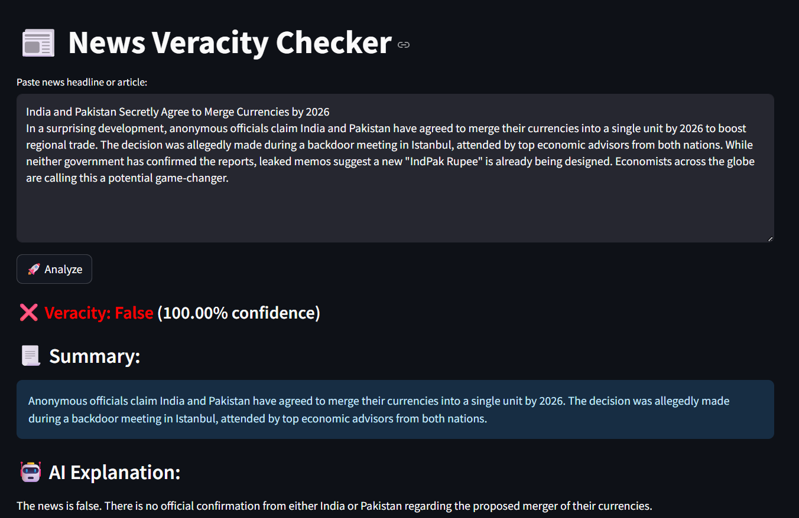

🔗 **Live Demo**: [Click here to try the app](https://huggingface.co/spaces/parshwa1404/news-veracity-checker)

# 📰 News Veracity Checker

With the explosive growth of social media, the spread of **fake news** has become a global crisis. According to the MIT Media Lab, **false information spreads six times faster** than true news on platforms like Twitter. Studies also show that nearly **64% of adults have been exposed to fake news online**, often without even realizing it.

That’s why I built this project: an **News Veracity Checker Using AI**. This tool classifies whether a news article or headline is **true or false** and provides a **fact-based explanation using an open-source language model**.

---

## 💡 Features

- ✅ **Veracity Score** – Classifies news as true or false using a BERT-based fake news detector
- 📃 **Article Summarizer** – Provides a concise summary of the content using Facebook’s BART model
- 🤖 **AI Explanation** – Uses Google’s Gemma-2B-Instruct LLM to generate fact-based rationales and corrections
- ☁️ **Word Cloud Visualization** – Visual insight into the most frequent keywords
- 🧠 **All models are run locally using Hugging Face Transformers**

---

## 🛠️ Tech Stack

- **Streamlit** – For interactive front-end interface
- **Hugging Face Transformers** – For veracity detection, summarization, and explanation generation
- **PyTorch**
- **Matplotlib & WordCloud** – For visualization
- **Models Used:**
  - `jy46604790/Fake-News-Bert-Detect` – for veracity classification
  - `facebook/bart-large-cnn` – for summarizing long news texts
  - `google/gemma-2b-it` – for AI-generated factual explanation

---

## 🚀 Live Demo

- You can try out the News Veracity Checker directly on Hugging Face Spaces:
👉 [Try it live here](https://huggingface.co/spaces/parshwa1404/news-veracity-checker)

---

### Live Demo Screenshot:

---

## 📝 How it Works

1. Input: Paste a news headline or article in the text box.

2. Processing: The system classifies the content using BERT, summarizes it using BART, and generates an AI-powered explanation using Gemma-2B.

3. Output:
  - Veracity Score: True or False classification of the article with a confidence score.
  - Summary: A concise version of the article.
  - Explanation: A detailed rationale explaining why the news is classified as true or false.